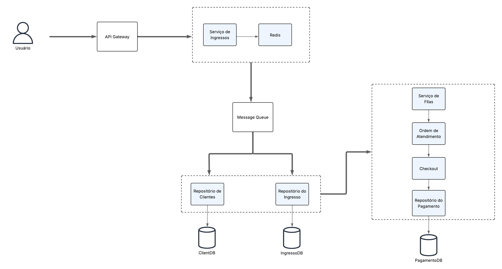

# 🎟️ Arquitetura de Sistema de Vendas de Ingressos - Rock in Rio

Este repositório apresenta a proposta de arquitetura de software para um sistema de vendas altamente concorridas, como para o evento **Rock in Rio**, onde milhões de acessos simultâneos podem acontecer e o número de ingressos disponíveis é limitado.

## 📌 Desafio

> "Você precisa garantir que o site só finalize a venda para pessoas que realmente vão receber o ingresso. Além disso, um cliente com internet mais lenta não pode ser prejudicado por outro mais veloz."

## 🧠 Solução Proposta

### 🎯 Objetivos da Arquitetura:
- **Evitar overbooking (vendas além da quantidade disponível)**
- **Manter a ordem de chegada (justo com quem possui internet mais lenta)**
- **Garantir escalabilidade horizontal**
- **Alta disponibilidade e performance**
- **Separação de responsabilidades (DDD)**

---

## 🧱 Componentes da Arquitetura

### Fluxo principal:

1. **Usuário** acessa o sistema via **API Gateway**.
2. API encaminha a solicitação ao serviço de ingressos, que verifica em tempo real a disponibilidade via **Redis**.
3. Caso disponível, o pedido é enfileirado na **Message Queue**.
4. O **Serviço de Filas** consome a fila e direciona os usuários para a **Ordem de Atendimento**, respeitando a ordem cronológica.
5. O usuário é redirecionado para o processo de **Checkout**, onde efetua o pagamento.
6. Os dados são persistidos nos repositórios adequados: `ClientDB`, `IngressoDB`, `PagamentoDB`.

---

## 💡 Tecnologias e Conceitos Utilizados

- **Arquitetura baseada em eventos**
- **Filas assíncronas (ex: RabbitMQ, Kafka)**
- **Cache distribuído com Redis**
- **Domain-Driven Design (DDD)**
- **Escalabilidade horizontal**
- **Resiliência e consistência eventual**

---

## 📂 Estrutura dos Serviços (Exemplo Conceitual)

/api-gateway
/ticket-service
/payment-service
/queue-service
/checkout
/database
├── ClientDB
├── IngressoDB
└── PagamentoDB

---

## 🗣️ Diferenciais

- Uso de **Redis** como cache para melhorar desempenho e garantir atomicidade na contagem de ingressos.
- **Fila de mensagens** que garante ordem justa de atendimento.
- **Separação por contexto de domínio** seguindo práticas de DDD.
- A arquitetura suporta **picos de acesso sem comprometer integridade dos dados**.

---

## 🚀 Como rodar?

> Esta proposta pode ser expandida em microserviços reais com `.NET`, `RabbitMQ`, `Redis`, `PostgreeSQL` e containers Docker.

---

## 📄 Licença

Este projeto é apenas um exercício técnico para fins de processo seletivo. =) 

---
